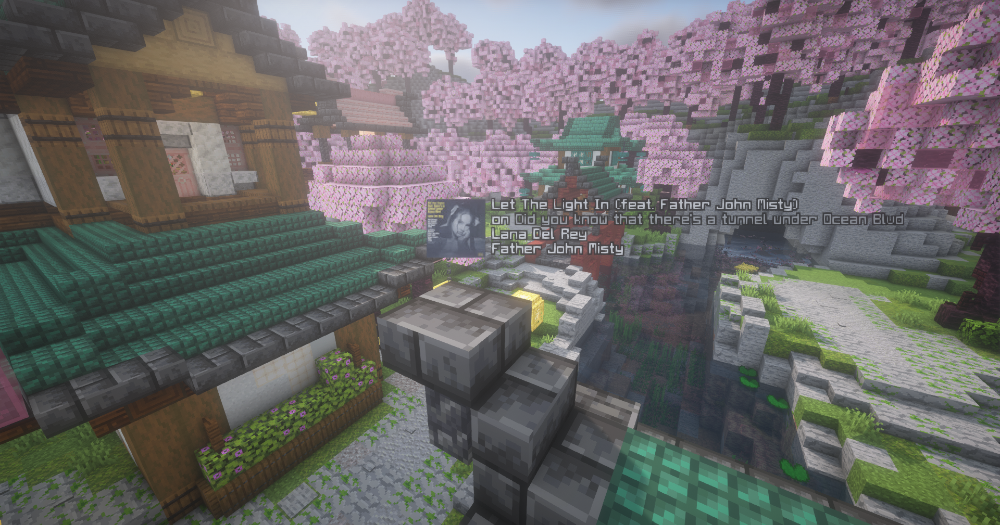

# -THIS IS A WORK IN PROGRESS-

# Spotify for Figura
BEFORE YOU DOWNLOAD THIS
### Errors
Sometimes this errors because I suck at coding :sob:
The code will probably explode at some point
I have no idea how to fix so just wait for an update ig
Uhm I also don't really trust that the http requests are secure so like use at your own risk :skull:
##### Known Issues
* Code explodes when loading next song after first song is finished
* Song will not auto update after song is skipped (because the data is requested every minute)
### Start

This is a project that allows you to visualize the currently playing track in figura
To start, create a `client_data` file in `figura/data/spotify/client_data` and insert a json table of credentials

### Example
```{
    "id": <CLIENT_ID>,
    "secret", <CLIENT_SECRET>
    "refresh_token": <REFRESH_TOKEN>
}
```
To get the client ID and secret, create a Spotify app [here](https://developer.spotify.com/dashboard).
You can get a refresh token by running the program [here](https://github.com/spotify/web-api-examples/tree/master/authorization/authorization_code).


Once the credentials are provided in `client_data`, the code should automatically create a new token once it expires using the refresh token.

### Visualization
By default, the skull of the player will be a Spotify Display. You can customize this by just retrieving the data provided by the function `album.getSongInfo()` in `spotifyAlbum.lua`. This function gives info such as the artists, song title, album title, current play time, track duration, etc.
The album cover is stored in `album.cache()` in `spotifyAlbum.lua` as a base64 string which can be used as a texture. It gets requested from a server and then stored in ``figura/data/spotify/cache` so that it doesn't have to request the image again.

In order for the avatar to actually display the image, you have to attach the link for a jpg to png converter API, I personally use a cloudinary account that y'all can set the link to `https://res.cloudinary.com/toasts/image/fetch/f_png/`

### Credits
* [manuel_2867](https://github.com/Manuel-3) - [runLater](https://github.com/Manuel-3/figura-scripts/blob/a598b44bdbed7877f1440d106d91ef1e194bc635/src/runLater/runLater.lua)
* [auriafoxgirl](https://github.com/auriafoxgirl) - base64 library
